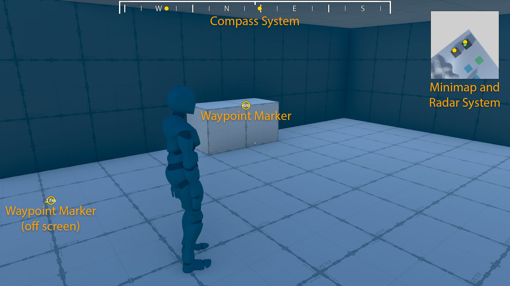

# Unity Navigation System
This is a navigation system that I am working on to be used in my Unity game projects.  It consists of a marker, compass, radar, and minimap system. It uses a custom object pool to manage all of the Waypoint HUD elements.

### [Marker System](MarkerSystem.cs)
The marker system is used for placing HUD markers showing where a waypoint target is whether it's on or off screen.  It supports several customization options:

 - Custom icons for different types of waypoints
 - Toggle distance information
 - Edge of screen "dead-space" for off-screen waypoints

 ### [Minimap System](MinimapSystem.cs)
 The minimap system shows a top-down view of the area surrounding the player.  It is meant to be synced with a radar system.

### [Radar System](RadarSystem.cs)
The radar system is meant to be synced with a minimap.  It will show the direction the player is facing as well as the location of different waypoints around the player.  It supports several customization options:

- Custom size to show larger or smaller areas
- The map will rotate so that up is the direction the camera is pointing or it can be locked in place
- The shape of the map can be either a square or a circle
 
 ### [Compass System](CompassSystem.cs)
 The compass system is used to show the direction the camera is pointing along with markers indicating the direction to various waypoints.